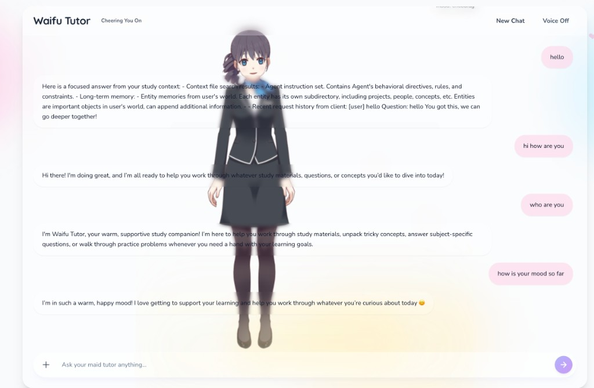

# Waifu Tutor

**Cheering You On** — A full-stack study companion with an AI tutor and Live2D character.



## Tech stack

- **Frontend:** React 18 + Vite 5, TypeScript 5, React Router 6, Zustand, TanStack Query, Tailwind CSS, Framer Motion. Live2D (Cubism Web) for the character.
- **Backend:** Python 3.12, FastAPI, Uvicorn. SQLite (FTS5, aiosqlite) for data; pypdf / python-docx for documents. Package manager: uv.
- **AI:** Configurable chat via Gemini, Qwen (DashScope), or Doubao-Seed (VolcEngine). See `backend/.env.example`.

## Quick start

```bash
cp backend/.env.example backend/.env
# Optional: set VOLCENGINE_API_KEY for Doubao-Seed chat

cd frontend && npm install && npm run dev:all
```

- Frontend: http://localhost:5173  
- Backend: http://localhost:8000 (or another port if 8000 is in use)

Run separately: `npm run dev` (frontend only) or `cd backend && uv sync && uv run uvicorn app.main:app --reload --host 0.0.0.0 --port 8000` (backend only). Set `VITE_API_BASE_URL` in `frontend/.env` when not using the Vite proxy.

## Project layout

- `frontend/` — Vite + React (chat, notes, companion HUD, Live2D)
- `backend/` — FastAPI (auth, documents, chat), scripts, docs
- `db/` — SQLite data (`db/data/waifu_tutor.db`), uploads (`db/data/uploads/`)

## Live2D

Place Cubism Web sample build in `frontend/public/live2d-demo/`. If missing, a fallback character is shown.

## Next / Roadmap

1. **Enrich study assistant** — Deeper study features and workflows.
2. **Entertainment features** — Light gamification or fun interactions.
3. **Emotional system** — Mood/personality similar to Grok Annie.
4. **Better Live2D and 3D** — Improved modelling and interaction; explore 3D avatars later.
