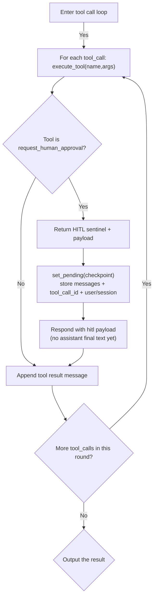

# Agentic Skill Workflow Flowchart

This document describes the current agentic workflow in the chat backend, including tool-calling, subskill loading, and human-in-the-loop (HITL) pause/resume.

## Flowchart

## Explanation

1. Startup context assembly:
- At startup, the backend loads tool schemas and builds a top-level skill registry from `SKILL.md` frontmatter.
- This context is injected into each chat turn so the model knows available tools and the required skill workflow.

2. Main agentic loop:
- Each chat request enters `_run_tool_loop()`.
- The model can either produce final content or issue tool calls.
- If tool calls are returned, each call is executed and appended as a `tool` message, then the model is called again.
- This is the tool-call subloop and can iterate for multiple rounds.

3. Skill and subskill usage via tools:
- For top-level skills, the model calls `load_skill(name)`. On success, the backend enters the skill execution pipeline and injects a system prompt with the full SKILL.md content.
- For subskills, the model calls `load_subskill(path)` under the configured skills root when the skill directs it.
- The loop does not have a separate Python skill engine; the model orchestrates steps by reading skill markdown and calling tools accordingly.

4. Empty-turn resilience:
- If the model returns neither content nor tool calls, the backend retries with guidance prompts up to a configured limit.
- If still empty, it returns a controlled recovery response instead of drifting into unrelated output.

5. Human-in-the-loop (HITL):
- When the model calls `request_human_approval`, tool execution returns a sentinel plus checkpoint payload.
- The chat loop pauses and stores pending state (messages, tool_call_id, session/user) with TTL.
- The API returns a `hitl` payload to the client for user input.
- On `/chat/hitl-response`, the saved state is resumed by injecting a synthetic tool result from the user decision, then continuing the same tool loop.

6. Fallback behavior:
- If the loop exits without a final response (for example max rounds), the backend uses fallback `ai_chat()` with compacted conversation history.

## Primary Code Locations

- `backend/app/main.py`
- `backend/app/context/context_builder.py`
- `backend/app/skills/registry.py`
- `backend/app/api/chat.py`
- `backend/app/tool/tools/__init__.py`
- `backend/app/tool/tools/load_skill.py`
- `backend/app/tool/tools/load_subskill.py`
- `backend/app/tool/tools/request_human_approval.py`
- `backend/app/hitl/store.py`
